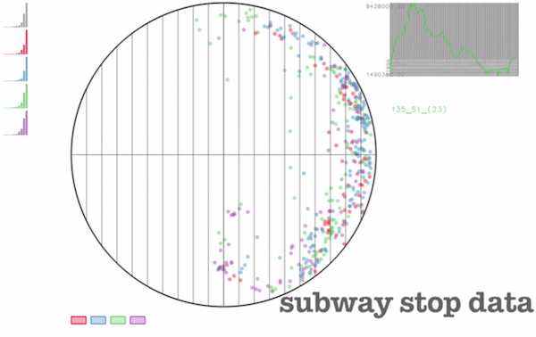

[**s-CorrPlot**: Visualizing Correlation](http://mckennapsean.github.io/scorrplot)
==================================================================================

The **s-CorrPlot** is an interactive scatterplot for visually exploring pairwise correlation coefficients between variables in large datasets. Variables are projected as points on a scatterplot with respect to some user-selected variables of interest, driven by a geometric interpretation of correlation. The correlation of all other variables to the selected one is indicated by vertical gridlines in the plot. By selecting new variables of interest, a user can create simple tours of the correlation space through animations between different projections of the data. For more details, check out [our companion paper](http://mckennapsean.com/projects/s-corrplot/).

Demo Video
----------

Installation
------------

    R
    install.packages("devtools")
    devtools::install_github("mckennapsean/scorrplot")

Demos
-----

Once installed, the R-package *scorr* includes datasets and demos to help you. Below is a list of the names of the demos which show correlation between the given variables.

- **gene1** : genes across different mice in two brain regions
- **gene2** : genes across different mice in nine brain regions
- **image** : image patches across two different image datasets
- **random** : random variables, illustrating how to build a data frame for *scorr*
- **subwayStops** : subway stop ridership in different regions of NYC
- **subwayTime** : subway ridership across the years in NYC

Then, for any demo name above:

    R
    library(scorr)
    demo(random)

Interactions
------------

Within the tool, you can interactively define new projections of the data by selecting new variables of interest in the plot or by selecting other data-driven projections, like the principal component bar charts. Animated transitions show the reorientation of the projection plane to these new selections. You can select primary and secondary variables of interest by left and right click, respectively.

There are also various keyboard commands within the tool, such as left and right arrow to adjust transparency of points in the s-CorrPlot. Furthermore, there are various queries from R that can pass data to and from the tool. For more details, please consult the package documentation.

System Requirements
-------------------

The **s-CorrPlot** is integrated within the R statistical framework for data input and output, but the interactive tool is largely written in C++ and OpenGL. It has been tested on Mac OS X and Linux.

To compile the *scorr* R-package, you need the following components:

-  **R** ([version 2.10 or newer](http://www.r-project.org/)) + [devtools](https://github.com/hadley/devtools)
-  **Xcode** (for *Mac*, [install Xcode](https://developer.apple.com/xcode/) and [download command line tools](https://developer.apple.com/support/xcode/))
-  **OpenGL** (for *Linux*, OpenGL library [like freeglut](http://freeglut.sourceforge.net/))

Development
-----------

To contribute to package development, please ensure you have a development environment that compiles the package. Then, download the code from GitHub into your own local folder.

Once you have entered that local folder in your terminal, simply enter the following commands to re-compile and test the package with any edits you make to the source:

    R
    devtools::load_all()

Then, you can test out the *scorr* tool inside R, such as:

    data(gene1)
    scorr(gene1)

Feel free to submit any issues or pull requests you have to us!

Uninstallation
--------------

Simply remove the *scorr* package:

    R
    remove.packages("scorr")

License
-------

This project's code is licensed by GPLv2.

Authors
-------

- [Sean McKenna](http://mckennapsean.com/)
- [Samuel Gerber](http://www.math.duke.edu/~sgerber/)

The *scorr* package was originally developed as the tool *gyroscope*, written by [Samuel Gerber](http://www.math.duke.edu/~sgerber/).

Contact
-------

If you have any difficulties or questions, please contact <sean@cs.utah.edu>.
